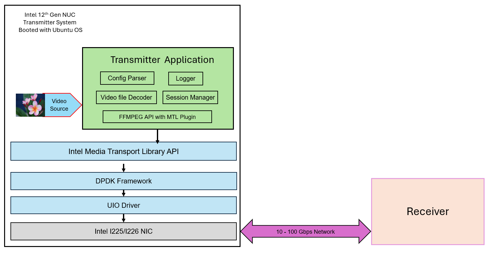

# Direct View LED Software Toolkit

[](LICENSE)
[](https://github.com/OpenVisualCloud/directview-led-software-toolkit/actions/workflows/ci.yml)
[](https://releases.ubuntu.com/jammy/)
[](https://github.com/OpenVisualCloud/Media-Transport-Library)
[](https://securityscorecards.dev/viewer/?uri=github.com/OpenVisualCloud/directview-led-software-toolkit)

## Table of Contents

- [Overview](#overview)
- [Notices](#notices)
- [Features](#features)
- [Building](#building)
  - [Prerequisites](#prerequisites)
  - [Build Steps](#build-steps)
- [Usage](#usage)
  - [Binding Ethernet Controller to DPDK PMD and Hugepage Setup](#binding-ethernet-controller-to-dpdk-pmd-and-hugepage-setup)
  - [JSON Configuration](#json-configuration)
- [Logging](#logging)
- [Command-Line Options](#command-line-options)
- [Supported Formats](#supported-formats)
- [Performance Considerations](#performance-considerations)
- [Running Unit Tests](#running-unit-tests)
- [Troubleshooting](#troubleshooting)
- [Contributing](#contributing)
- [License](#license)

## Overview

Direct View LED Software Toolkit is a simplified, standalone transmitter application using FFmpeg APIs and Media Transport Library (MTL) plugin.

### What It Does

dvledtx reads a video source file (e.g., MP4), decodes it using FFmpeg, and transmits uncompressed video frames over an IP network using the SMPTE ST 2110-20 standard. Multiple crop regions of the same source video can be transmitted simultaneously as independent RTP streams — enabling tiled LED wall configurations where each panel receives its own portion of the frame.

### Use Case

- **LED Video Walls**: Drive multiple LED panels from a single source, each panel receiving a cropped region of the full frame.

### Architecture



### System Requirements

| Component | Requirement |
|-----------|-------------|
| **OS** | Validated on Ubuntu 22.04 LTS; should work on Ubuntu 24.04 and higher |
| **CPU** | Intel 12th Generation (Alder Lake) or above |
| **NIC** | Intel Ethernet Controller I225 or above |
| **Memory** | Hugepages configured (typically 2GB+) |
| **Kernel** | IOMMU and VFIO support enabled |

## Notices

### FFmpeg

FFmpeg is an open source project licensed under LGPL and GPL. See https://www.ffmpeg.org/legal.html. You are solely responsible for determining if your use of FFmpeg requires any additional licenses. Intel is not responsible for obtaining any such licenses, nor liable for any licensing fees due, in connection with your use of FFmpeg.

## Features

- **ST20P Video Transmission**: Uncompressed video over SMPTE ST 2110-20
- **Multi-session Support**: Multiple concurrent video streams
- **JSON Configuration**: Per-session crop and network settings via JSON config
- **Memory Efficient**: Uses hugepages for optimal performance

## Building

### Prerequisites

#### Hardware Requirements
- Intel 12th Generation CPU or above 
- Intel Ethernet Controller I225 or above

#### Software Requirements

> **Note:** This toolkit has been validated against **Ubuntu 22.04 LTS** but should work on Ubuntu 24.04 LTS and higher versions.

- Ubuntu [22.04](https://releases.ubuntu.com/jammy/) or [24.04](https://releases.ubuntu.com/noble/) LTS
- [Media Transport Library (MTL) v26.01+](https://github.com/OpenVisualCloud/Media-Transport-Library/blob/ffmpeg-plugin-extra-pixel-format/doc/build.md)
  - Follow these steps
    - [Install APT packages](https://github.com/OpenVisualCloud/Media-Transport-Library/blob/ffmpeg-plugin-extra-pixel-format/doc/build.md#111-ubuntudebian)
    - Clone Media-Transport-Library
      ```
      git clone https://github.com/OpenVisualCloud/Media-Transport-Library.git
      cd Media-Transport-Library
      git checkout ffmpeg-plugin-extra-pixel-format
      cd ..
      export mtl_source_code=${PWD}/Media-Transport-Library
      ```
    - [Build and install DPDK](https://github.com/OpenVisualCloud/Media-Transport-Library/blob/ffmpeg-plugin-extra-pixel-format/doc/build.md#2-dpdk-build-and-install)
    - [Build and install MTL](https://github.com/OpenVisualCloud/Media-Transport-Library/blob/ffmpeg-plugin-extra-pixel-format/doc/build.md#3-build-media-transport-library-and-app)
- [FFmpeg 7.0 with MTL Plugin](https://github.com/OpenVisualCloud/Media-Transport-Library/blob/ffmpeg-plugin-extra-pixel-format/ecosystem/ffmpeg_plugin/README.md#1-build)

### Build Steps

Once all dependencies are installed, clone this repository and run the build script:

```bash
git clone https://github.com/OpenVisualCloud/directview-led-software-toolkit
cd directview-led-software-toolkit
bash scripts/build.sh
```

To build with MTL TX support enabled:

```bash
bash scripts/build.sh -Denable_mtl_tx=true
```

The built binary will be available at `build/dvledtx`.

## Usage

### Binding Ethernet Controller to DPDK PMD and Hugepage Setup 

- Ensure VFIO group exists [follow](#vfio-group-setup)
- [DPDK PMD Setup](https://github.com/OpenVisualCloud/Media-Transport-Library/blob/ffmpeg-plugin-extra-pixel-format/doc/run.md#3-dpdk-pmd-setup)
- [Hugepage Setup](https://github.com/OpenVisualCloud/Media-Transport-Library/blob/ffmpeg-plugin-extra-pixel-format/doc/run.md#4-setup-hugepage)

### JSON Configuration

dvledtx uses a JSON config file with three sections:

| Section | Field | Description |
|---------|-------|-------------|
| **log_file** | `log_file` | (Optional) Path/name of the log output file (e.g. `dvledtx.log`). If omitted, logging goes to console only. |
| **interfaces** | `name` | PCI BDF address of the NIC (e.g. `0000:06:00.0`) |
| | `sip` | Source IP address |
| | `dip` | Destination multicast IP address |
| **video** | `width` | Source frame width in pixels |
| | `height` | Source frame height in pixels |
| | `tx_url` | Path to the source video file |
| **tx_video** | `scale_width` | (Optional) Output width after scaling |
| | `scale_height` | (Optional) Output height after scaling |
| | `fps` | Frames per second (25, 30, 50, 60) |
| | `fmt` | Pixel format (see [Supported Formats](#supported-formats)) |
| **tx_sessions[]** | `udp_port` | UDP port for the session |
| | `payload_type` | (Optional) RTP payload type — defaults to `96` if not present |
| | `crop` | Region to transmit: `x`, `y`, `w`, `h` in pixels |

Example (`config/tx_fullhd_single_session.json`):
```json
{
  "log_file": "dvledtx.log",
  "interfaces": [
    { "name": "0000:06:00.0", "sip": "192.168.50.29", "dip": "239.168.85.20" }
  ],
  "video": {
    "width": 1920, "height": 1080,
    "tx_url": "bbb_sunflower_1080p_30fps_normal.mp4"
  },
  "tx_video": {
    "fps": 30, "fmt": "yuv422p10le"
  },
  "tx_sessions": [
    { "udp_port": 20000, "crop": { "x": 0, "y": 0, "w": 1920, "h": 1080 } }
  ]
}
```

Multiple sessions can be defined in `tx_sessions` to transmit different crop regions of the same video simultaneously (see `config/tx_fullhd_multi_session.json`).

## Logging

dvledtx includes a built-in logger with configurable output targets and log levels.

### Log File

Specify a log file in the JSON config with the top-level `log_file` field:

```json
{
  "log_file": "dvledtx.log",
  ...
}
```

When `log_file` is set, log output is written to that file in addition to the console. If the field is omitted, output goes to the console only.

### Log Levels

| Level | Description |
|-------|-------------|
| `ERROR` | Critical failures only |
| `WARN` | Non-fatal warnings |
| `INFO` | General operational messages (default) |
| `DEBUG` | Verbose diagnostic output |

### Examples

#### Using JSON Configuration (recommended)
```bash
./build/dvledtx --config config/tx_fullhd_single_session.json
```

## Command-Line Options

| Option | Description |
|--------|-------------|
| `-C, --config <file>` | JSON config file (required) |
| `-v, --version` | Show version and exit |
| `--help` | Show help message |

#### Show Version
```bash
./build/dvledtx --version
# or
./build/dvledtx -v
```

## Supported Formats

### Video Formats

| Format | Chroma | Bit Depth | Color Space |
|--------|--------|-----------|-------------|
| `yuv422p10le` | 4:2:2 | 10-bit | YUV |
| `yuv420` | 4:2:0 | 8-bit | YUV |
| `yuv444p10le` | 4:4:4 | 10-bit | YUV |
| `gbrp10le` | 4:4:4 | 10-bit | RGB |
| `yuv422p12le` | 4:2:2 | 12-bit | YUV |
| `yuv444p12le` | 4:4:4 | 12-bit | YUV |
| `gbrp12le` | 4:4:4 | 12-bit | RGB |

### Frame Rates
- 25 fps
- 30 fps
- 50 fps
- 60 fps

### Resolutions

| Resolution | Dimensions | Description |
|------------|------------|-------------|
| **1080p** (Full HD) | 1920x1080 | Standard HD resolution |
| **2K** (QHD) | 2560x1440 | Quad HD / 2K resolution |
| **4K** (UHD) | 3840x2160 | Ultra HD / 4K resolution |

> **Note:** Maximum supported resolution is 3840x2160. Width must be even for YUV format alignment.

### Video Scaling

dvledtx supports upscaling and downscaling via optional `scale_width` and `scale_height` fields in the video configuration block. When set, the decoded source video is scaled to the specified dimensions before crop regions are applied.

| Feature | Description |
|---------|-------------|
| **Upscale** | Scale smaller source (e.g. 1080p) to larger output (e.g. 4K) |
| **Downscale** | Scale larger source (e.g. 4K) to smaller output (e.g. 1080p) |
| **Single session** | Full scaled frame transmitted as one stream |
| **Multi-session** | Crop regions applied to scaled frame for tiled LED walls |
| **Max output** | 3840x2160 (4K UHD) |

Example — upscale 1080p source to 4K output:
```json
{
  "video": {
    "width": 1920, "height": 1080,
    "tx_url": "source_1080p.mp4"
  },
  "tx_video": {
    "scale_width": 3840, "scale_height": 2160,
    "fps": 30, "fmt": "yuv422p10le"
  },
  "tx_sessions": [
    { "udp_port": 20000, "crop": { "x": 0, "y": 0, "w": 3840, "h": 2160 } }
  ]
}
```

Log output when scaling is active:
```
[INFO ] Video: 1920x1080 -> scale 3840x2160 30fps yuv422p10le  tx_url=source_1080p.mp4
[INFO ]   Session 0: udp_port=20000 pt=96 crop=[0,0 3840x2160]
```

> **Note:** When `scale_width`/`scale_height` are set, crop bounds are validated against the scaled dimensions, not the source dimensions. Both fields must be specified together, and the scaled dimensions must satisfy the pixel format's chroma-alignment constraints (e.g. `yuv420` requires even width and height; `yuv422*` requires even width).

## Performance Considerations

### Optimization Features
- **Hugepage Memory**: All buffers allocated on hugepages
- **Zero-copy Design**: Minimal memory copying
- **Hardware Acceleration**: Uses MTL's hardware features
- **Efficient Threading**: Minimal context switching

### Running Unit Tests

Install dependencies if not present
```
sudo apt install libcmocka-dev
pip install gcovr
```

To build and run all unit tests with coverage:

```bash
bash scripts/test.sh
```

To run tests without generating a coverage report:

```bash
bash scripts/test.sh --no-coverage
```

## Troubleshooting

### IOMMU / VFIO Kernel Parameters (GRUB)

MTL requires IOMMU and VFIO kernel parameters to be set. If MTL fails to initialize or VFIO devices are not accessible, check that the following parameters are present in `/etc/default/grub`:

```
intel_iommu=on iommu=pt pcie_aspm=off pcie_port_pm=off vfio-pci.disable_idle_d3=1
```

To add them manually:

1. Open `/etc/default/grub` in a text editor:
   ```bash
   sudo nano /etc/default/grub
   ```

2. Append the missing parameters to `GRUB_CMDLINE_LINUX_DEFAULT`, for example:
   ```
   GRUB_CMDLINE_LINUX_DEFAULT="quiet splash intel_iommu=on iommu=pt pcie_aspm=off pcie_port_pm=off vfio-pci.disable_idle_d3=1"
   ```

3. Update GRUB and reboot:
   ```bash
   sudo update-grub
   sudo reboot
   ```

> **Note:** A reboot is required for the IOMMU/VFIO parameters to take effect.

### VFIO Group Setup

MTL uses VFIO to access the NIC. The current user must belong to the `vfio` group.

1. Create the `vfio` group if it does not exist:
   ```bash
   sudo groupadd vfio
   ```

2. Add your user to the group:
   ```bash
   sudo usermod -aG vfio $USER
   ```

3. Apply the group membership without logging out:
   ```bash
   newgrp vfio
   ```

   Or log out and back in for the change to take effect permanently.

4. Verify group membership:
   ```bash
   id -nG $USER
   ```

### Killing the Application

If `dvledtx` becomes unresponsive or needs to be force-stopped:

```bash
sudo pkill -9 -f dvledtx
```

### Common Issues

1. **MTL Initialization Failed**
   - Check network port PCI address matches your hardware:
     ```bash
     lspci | grep Ethernet
     # Example output: 06:00.0 Ethernet controller: Intel Corporation ...
     # Use BDF format in config: "0000:06:00.0"
     ```
   - Verify MTL library is properly installed:
     ```bash
     # Check MTL shared library is present
     ldconfig -p | grep mtl
     # Expected: libmtl.so (libc6,x86-64) => /usr/local/lib/x86_64-linux-gnu/libmtl.so

     # Check MTL pkg-config file is available
     pkg-config --modversion mtl
     # Expected: 26.01.0.REL (or higher)

     # Check MTL header files exist
     ls /usr/local/include/mtl/mtl_api.h
     ```
   - Verify DPDK is installed and the NIC is bound to VFIO:
     ```bash
     # Check DPDK installation
     pkg-config --modversion libdpdk

     # Check NIC binding status
     sudo $mtl_source_code/script/nicctl.sh list
     # Or use dpdk-devbind.py:
     dpdk-devbind.py --status
     # The target NIC should show "drv=vfio-pci"
     ```
   - Ensure IOMMU is enabled (see [IOMMU/VFIO Kernel Parameters](#iommu--vfio-kernel-parameters-grub)):
     ```bash
     dmesg | grep -i iommu
     # Should show "DMAR: IOMMU enabled"
     cat /proc/cmdline | grep intel_iommu
     ```
   - Verify network card is supported (Intel I225, I226, E810 series)

2. **Cannot Load Source File**  
   - Check file exists and is readable:
     ```bash
     ls -la /path/to/video.mp4
     ```
   - Verify the file is a valid video (not corrupted):
     ```bash
     ffprobe /path/to/video.mp4
     # Should show video stream info without errors
     ```
   - Ensure sufficient disk space:
     ```bash
     df -h .
     ```
   - Verify file format matches config parameters (resolution, pixel format)
   - Note: Symlinked files are rejected for security reasons

3. **Network Transmission Issues**
   - Ensure network card supports required bandwidth (uncompressed 1080p30 ≈ 1.8 Gbps)
   - Verify hugepages are allocated:
     ```bash
     cat /proc/meminfo | grep HugePages
     # HugePages_Free should be > 0
     ```

4. **Hugepage Allocation Failure**
   - Check current hugepage status:
     ```bash
     cat /proc/meminfo | grep Huge
     ```
   - Allocate hugepages (requires root):
     ```bash
     sudo sysctl -w vm.nr_hugepages=2048
     # Or make persistent in /etc/sysctl.conf
     ```

5. **Permission Denied (VFIO)**
   - Ensure user is in the `vfio` group (see [VFIO Group Setup](#vfio-group-setup))
   - Check VFIO device permissions:
     ```bash
     ls -la /dev/vfio/
     # Group should be 'vfio' with rw permissions
     ```

## Contributing

Contributions are welcome. Please open an issue or submit a pull request on [GitHub](https://github.com/OpenVisualCloud/directview-led-software-toolkit).

## License

This project is licensed under the BSD 3-Clause License. See [LICENSE](LICENSE) for details.

